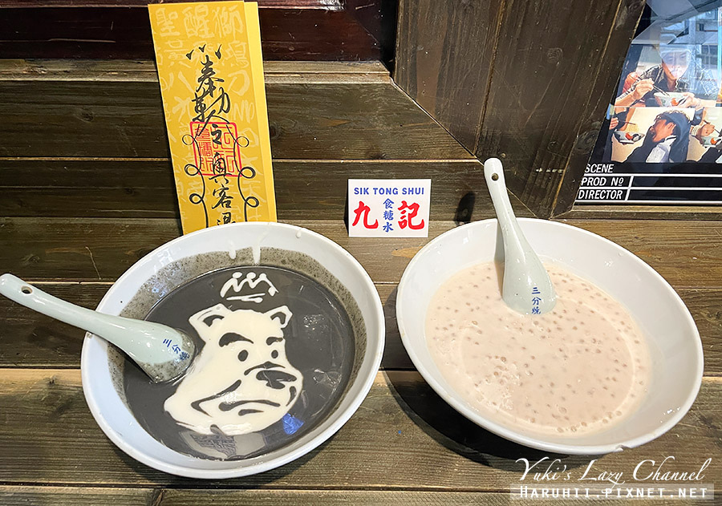
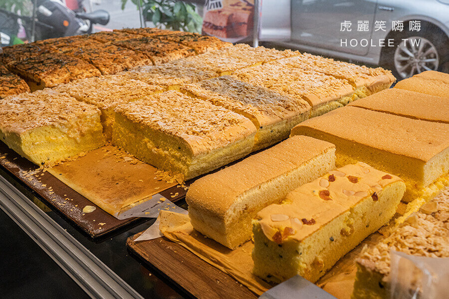

<html><head>
<title>圖片練習</title>
</head>
<body>

<a href="2nd.index.html">舒服蕾</a>
<a href="3nd.index.html">九記食糖水</a>
<a href="4nd.index.html">朵玫絲甜點森林</a>
<a href="5nd.index.html">心得</a>

<table border="1">
<tbody><tr>
<th valign="bottom"><h2>圖片</h2></th>
<th valign="bottom"><h2 valign="middie">標題</h2></th>
<th valign="bottom"><h2 valign="middie">說明</h2></th>
</tr>

<tr>
<td></td>
<td align="center"><h3>帶有蓬鬆綿密空氣感的鬆餅，幸福的甜蜜滋味，激推 六盛茶苑 舒芙蕾鬆餅專賣</h3></td>
<td align="center">使用勤億葉黃素是好蛋製作，高成本的雞蛋搭配手打奶泡麵糊，麵粉使用日本麵粉
在口感香氣上絕對可以感受到用料的實在頂級、高成本
很多身邊姊妹吃過，都覺得六盛茶苑舒芙蕾鬆餅很好吃。 </td>
</tr>

<tr>
<td></td>
<td align="center"><h3>黑色店面寫著「食糖水」三個字，在粵語中就是喝甜湯的意思啦～</h3></td>
<td align="center">九記食糖水除了店內濃厚的香港風格外，老闆運用甜品的創意手繪更是必看

老闆信手捻來用芝麻糊與杏仁糊就畫出太極圖樣、人臉等等，實在有趣～ </td>
</tr>

<tr>
<td></td>
<td align="center"><h3> 近期又推出全新療癒口味的現烤蛋糕甜點啦！</h3></td>
<td align="center">新推出的炙燒蒜香起司絕對濃郁，完全滿足蒜味愛好者的味蕾！柔軟濕潤的蛋糕加起司夾心，有鹹鹹的奶香風味～ </td>
</tr></tbody></table></body></html>
